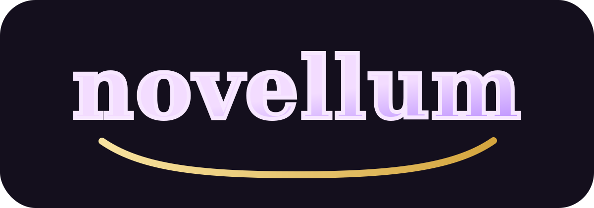

# novellum

<p align="center">
  
</p>

 

A CLI linked LaTeX note system for research logbooks.

> [!NOTE]
> This project is still early in development. The current workflow is already usable, but there is still a lot of room to improve and polish.
> If you have ideas, open an _issue_.

`novellum` is for people who want Obsidian-style linking and graph navigation, but do not want to leave normal LaTeX files behind.

Notes are just `.tex` fragments. Metadata lives in a LaTeX comment block. Links use `\nvlink{...}`. Bibliography stays in a shared `references.bib`. The workspace has a normal `tex/workspace.tex` root so editor tooling like VimTeX can still behave like it is inside a regular LaTeX project.

This repo came from a very particular irritation.

I wanted a notebook for theorem scraps, proof fragments, reading notes, and lab
log entries. I wanted linking and graph navigation. I also wanted normal TeX
files, normal shell tools, normal editor integration, and had approximately zero
interest in migrating my research notes into an app that would like to become
my entire lifestyle.

So the project became:

* local first, because I can't afford to pay Google Drive.
* LaTeX native, i.e. no funny parsing tricks that could make the LaTeX compiler angry.
* graph aware, i.e. fancy words that Obsidian people like to use
* CLI driven, for pedantic terminal users like me
* mildly theatrical, because apparently I cannot resist putting a little lore into my tooling

It also exists because my patience for opening a heavy note app just to write three lines of operator theory and one cursed bibliography entry is, technically speaking, not infinite.

> [!NOTE]
> The name _novellum_.
> I am obsessed with VTubers, and I put references everythwere I can. It is a mashup of [Shiori Novella](https://www.youtube.com/@ShioriNovella) and a __vellum__.

## Features

* Linked LaTeX notes with metadata stored in comment blocks
* Canonical IDs plus alias-based note resolution
* Search across IDs, titles, tags, aliases, and body text
* Backlinks and broken-link diagnostics
* Mermaid graph export for the note network
* Research log workflow with dated `log` notes and a `today` command
* Stitched LaTeX output for selected notes or the whole workspace
* Clickable internal note links inside stitched compiled documents
* Workspace root configured for `natbib` and BibTeX instead of `biblatex`/`biber`
* PDF opening through a configurable viewer command
* Default interactive note selection via `fzf`

## Installation

For now, install it with `pip` from the project root:

```sh
pip install .
```

You will probably also want:

1. a LaTeX toolchain with `latexmk`
2. BibTeX
3. an editor configured through `$EDITOR`
4. `fzf` if you want the default interactive selection flow

## Quickstart

See the [10-minute guide](https://leogabac.github.io/novellum/getting-started/10-minute-guide/)

## Usage

There are a few main workflows.

### Basic note workflow

Create notes:

```sh
novellum new "Heat Kernel Experiment" --type experiment --alias hk
novellum new "Operator Semigroup" --type concept
novellum rename operator-semigroup operator-semigroup-notes
novellum move heat-kernel-experiment paper
novellum rename
```

Inspect them:

```sh
novellum list
novellum ls
novellum show
novellum edit
novellum show hk --no-interactive
novellum edit operator-semigroup --no-interactive
```

### Graph workflow

Find outgoing links, backlinks, and diagnostics:

```sh
novellum links
novellum backlinks
novellum broken
novellum graph --output build/graph.mmd
novellum graph --render svg
```

The plain `graph` command writes Mermaid text to stdout. File export and render
paths print status lines instead.

### Logbook workflow

Create an explicit dated log:

```sh
novellum log new --date 2026-04-03
```

Or just open today's:

```sh
EDITOR="nvim" novellum today
```

### Document workflow

Stitch specific notes:

```sh
novellum stitch spectral-gap lemma-poincare --title "Analysis Draft"
novellum stitch --concepts --proofs --title "Theory Notes"
novellum stitch beta --concepts
novellum stitch --title "Choose Notes Interactively"
```

Stitch everything:

```sh
novellum stitch --all --title "Notebook Draft"
```

Add stitched-only LaTeX packages or macros in `tex/stitched-preamble.tex`:

```tex
\usepackage{physics}
```

Compile either the workspace root or the stitched output:

```sh
novellum compile
novellum compile stitched
novellum compile build/drafts/custom.tex
```

Compile status is emitted through `sysentropy`, so successful runs show
logger-style progress messages before and after `latexmk`.

Open the resulting PDFs:

```sh
novellum open
novellum open stitched
novellum open workspace
NOVELLUM_PDF_VIEWER="zathura" novellum open stitched
```

## Current Commands

See the [CLI documentation](https://leogabac.github.io/novellum/cli/).

## Documentation

See the published [documentation site](https://leogabac.github.io/novellum/).

## Roadmap

The project is usable enough now ...

The fuller roadmap lives in [docs/roadmap.md](docs/roadmap.md).
